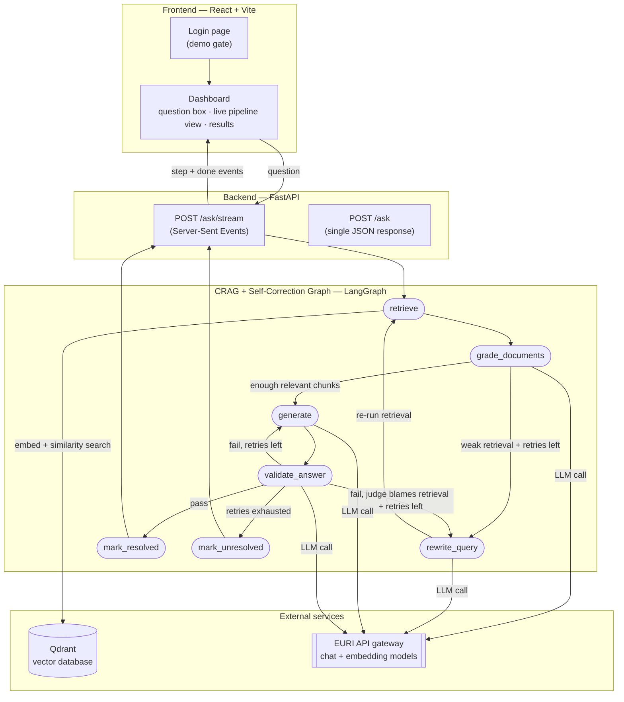
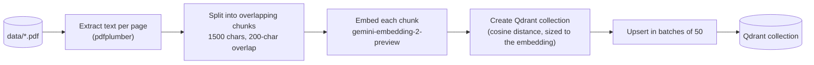
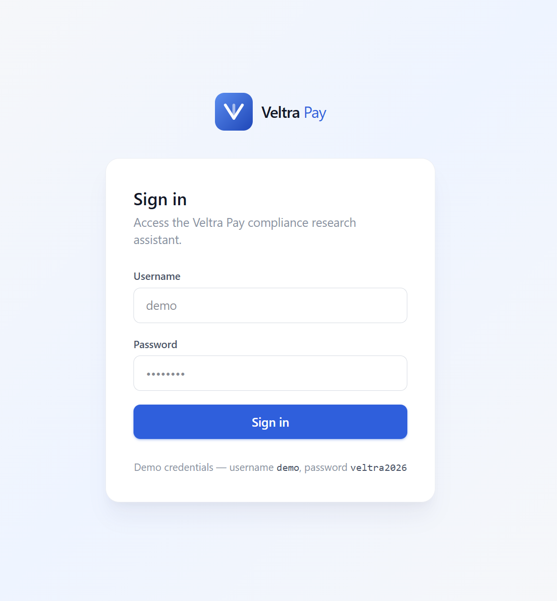

# Veltra Pay — Compliance Research Assistant

A Corrective RAG (CRAG) + Self-Correcting RAG agent that answers regulatory/compliance questions grounded in a fintech document library (PCI DSS, FCA Payment Services Regulations, PFMI, cross-border payments standards, payment methods), with a React frontend and a FastAPI backend on top.

---

## 1. The business problem

Compliance teams at a payments company need fast, trustworthy answers to questions like *"How does PCI DSS relate to our obligations under the FCA's Payment Services Regulations?"* — without manually searching hundreds of pages across multiple regulatory PDFs.

A naive RAG chatbot is risky here: it can retrieve irrelevant passages and answer from them anyway, or generate a confident-sounding answer that isn't actually grounded in the source material. In a compliance context, a hallucinated answer isn't just wrong — it's the kind of wrong that leads to real regulatory exposure.

This project is a RAG pipeline that **checks its own work at two points**: it grades whether what it retrieved is actually relevant before answering, and it evaluates its own generated answer for grounding, hallucination risk, and completeness before returning it — retrying automatically when either check fails, within a bounded number of attempts.

---

## 2. What is CRAG and what is a Self-Correcting RAG Agent?

**Corrective RAG (CRAG)** is a RAG variant where the retrieval step is treated as untrusted by default. Instead of feeding every retrieved chunk straight into the answer, the system grades each chunk as relevant or irrelevant. If too few chunks are relevant, it rewrites the search query and retries retrieval — capped at a maximum number of retries so it can't loop forever.

**Self-Correcting RAG Agent** goes a step further: after the answer is generated, the agent evaluates *its own answer* — is it grounded in the retrieved context, what's the hallucination risk, is it complete, and was the retrieved context itself insufficient to answer well? If the answer fails this check, the agent retries — either regenerating the answer or looping back to fix retrieval — again capped at a maximum retry count.

## 3. CRAG vs. Self-Correcting RAG Agent — what's the actual difference?

They correct **different stages** of the pipeline:

| | Corrects | When it fires | What it changes |
|---|---|---|---|
| **CRAG** | The *input* to generation | Before the answer is written | Rewrites the search query, re-retrieves documents |
| **Self-Correcting RAG Agent** | The *output* of generation | After the answer is written | Regenerates the answer, or loops back to retrieval if the judge blames the context |

This project implements both as a single combined graph: CRAG handles retrieval-side correction, and the self-correction layer wraps around generation as an outer validation loop — including the ability for validation failures to trigger a fresh CRAG retrieval cycle, not just a re-generation.

---

## 4. The CRAG pipeline

```
Question → Retrieve → Grade Documents → [weak? Rewrite Query → Retrieve again] → Generate → Validate → [fail? Retry] → Resolved / Unresolved
```

- **Retrieve** — embeds the question and pulls the top-5 most similar chunks from Qdrant.
- **Grade Documents** — one LLM call grades every retrieved chunk as `relevant`/`irrelevant`.
- **Rewrite Query** — fires only if fewer than half the chunks are relevant *and* retries remain; rewords the query using the original question plus the failed query, then retrieval runs again.
- **Generate** — writes the answer using only the chunks graded `relevant`, always addressing the *original* question even if the search query was rewritten.
- **Validate** — one LLM call checks four things at once: is the answer grounded, what's the hallucination risk (low/medium/high), is it complete, and was retrieval itself insufficient.
- **Retry logic** — on a failed validation: if the judge blames retrieval and retries remain, loop back to `rewrite_query`; otherwise regenerate the answer. Once retries are exhausted, the run ends as `resolved` or `unresolved` regardless.

Retry limits (`max_retrieval_retries`, `max_validation_retries`) default to 2 each and are what prevent infinite loops.

---

## 5. Architecture



The frontend calls `/ask/stream`, which streams one event per graph node as it actually completes — so the UI shows live progress (including retries) instead of a blank screen until the whole run finishes. `/ask` is a simpler, non-streaming equivalent that returns the same final payload in one response.

---

## 6. Data ingestion pipeline

Run once (or whenever the source documents change), before asking any questions:



Each chunk is stored with its source filename and page number as payload, so every answer can cite exactly where it came from.

---

## 7. Models used and observed latency

Three chat models were evaluated against the same EURI API gateway during development. Numbers below are averaged from real runs of this pipeline (multiple LLM calls per question: grading, possibly rewriting, generation, validation).

| Model | Role | Reliability observed | Typical latency per call | Notes |
|---|---|---|---|---|
| `gemini-embedding-2-preview` | Embeddings (ingestion + query time) | Reliable | ~0.6 – 1.2s | 3072-dimension vectors |
| `gemini-2.5-flash` | Early "fast" model for grading/rewriting/validation | **Unreliable** | 6s – 380s+ per call, frequent 5xx/timeout errors | Dropped after EURI dashboard confirmed the backend itself was overloaded, not our prompts |
| `kimi-k3` | Original default chat model | Reliable (small sample) | ~24 – 50s per call | Consistent but only tested lightly before switching |
| `gpt-5.6-sol` | **Current model — used for every node** | Reliable, zero observed errors | ~1.3 – 16.2s per call, ~20 – 70s total per full question (3–9 chained calls depending on retries) | Standardized on this after direct comparison; fastest and most consistent of the three |

The app also includes built-in retry/backoff around every chat model call (3 attempts, exponential backoff) to absorb any future transient provider errors without failing the whole run.

---

## Screenshots

**Sign in** — a demo-only gate in front of the assistant.



**Asking a question** — live pipeline progress streams in as each graph node actually completes.


**Result** — grounded answer with citations, resolution status, retry counts, token/time stats, and the graded source chunks.


---

## 8. Running this project

### Prerequisites

- Python 3.11+
- Node.js 18+
- A Qdrant instance (Qdrant Cloud free tier works) and an EURI API key (`api.euron.one`)

### 1. Clone and set up the backend

```bash
git clone <your-repo-url>
cd SelfCRAG

python -m venv .venv
source .venv/Scripts/activate      # Windows (Git Bash) — use .venv\Scripts\activate on cmd/PowerShell
# source .venv/bin/activate         # macOS/Linux

pip install -r requirements.txt
```

### 2. Configure environment variables

```bash
cp .env.example .env
```

Fill in `.env` with your real values:

```
EURI_EMBED_MODEL = "gemini-embedding-2-preview"
CHAT_MODEL = "gpt-5.6-sol"
EURI_BASE_URL = "https://api.euron.one/api/v1/euri"
EURI_API_KEY = "<your EURI API key>"
QDRANT_URL = "<your Qdrant cluster URL>"
QDRANT_API_KEY = "<your Qdrant API key>"
QDRANT_COLLECTION = "<a collection name, e.g. selfcrag>"
```

### 3. Ingest the documents

Drop your PDFs into `data/`, then:

```bash
python -m rag.ingest
```

This embeds and uploads every chunk into your Qdrant collection. Re-run it any time the source documents change.

### 4. Run it

**Option A — CLI:**

```bash
python main.py
```

Type a question when prompted; the full pipeline output (answer, retrieved chunks + grades, status, retry counts, tokens, time) prints to the terminal.

**Option B — Web app:**

Terminal 1 (backend):

```bash
python -m uvicorn api.server:app --port 8000 --reload
```

Terminal 2 (frontend):

```bash
cd frontend
npm install
npm run dev
```

Open **http://localhost:5173**, sign in with `demo` / `veltra2026` (a demo-only gate, no real auth backend), and ask a question. You'll see the pipeline steps light up live as they complete.

> If `npm run dev` reports a port other than 5173, something else is holding it — the backend's CORS is locked to `localhost:5173`, so a different port will fail with a CORS error in the browser console. Free the port and restart.

---

## 9. Links

- **GitHub repository:** `<add your repo URL here>`
- **YouTube walkthrough:** coming soon
- **Connect on LinkedIn:** [linkedin.com/in/saurabh-kamal](https://www.linkedin.com/in/saurabh-kamal/)
